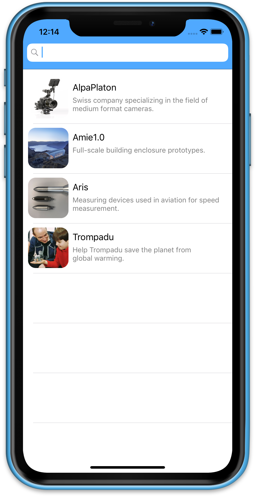

&nbsp;&nbsp;&nbsp;&nbsp;&nbsp;&nbsp;&nbsp;&nbsp;&nbsp;

<!-- # Hello!
*Thanks for stopping by*. This repo serves as a kind of ever-changing portfolio of projects I'm currently excited about; please feel free to look around. -->
# PushingBoundaries
PushingBoundaries is an iOS app for the "Pushing Boundaries" 3D-print model exhibition in Germany , which I recently built as a take-home project. The specs were to build a basic museum app, and to then extend it with augmented reality. I decided to run with it and build something a bit more informative, creative, and colorful. In my app, the 3D models are organized in table view for easy scrolling and searching and then thenks to image tracking in iOS, when the visitor point the camera to an exhibit,  a video will be superimposed on the back camera view with augmented reality

I'm extremely pleased with how the project came out. I'm particularly proud of the app's responsiveness, UI design, and easily-extended architecture. PushingBoundaries was built with Xcode and written entirely in Swift 5; it utilizes Auto Layout for UI design, and makes extensive use of UIView animations.  

-->
&nbsp;&nbsp;&nbsp;&nbsp;&nbsp;>

## Thanks for stopping by!

# Contact Info:

- Email: laurentbrusa@me.com
- LinkedIn: [laurentBrusa](www.linkedin.com/in/laurentbrusa)
- Twitter: [@wrmultitudes](https://twitter.com/wrmultitudes)
- Website: [multitudes](https://multitudes.github.io)
