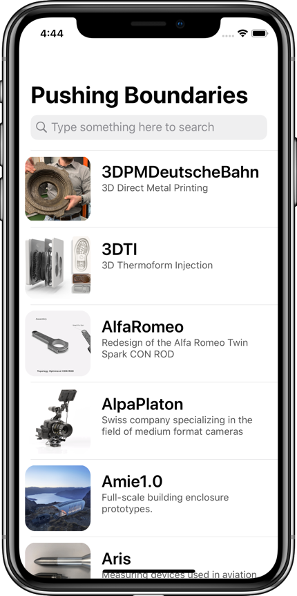
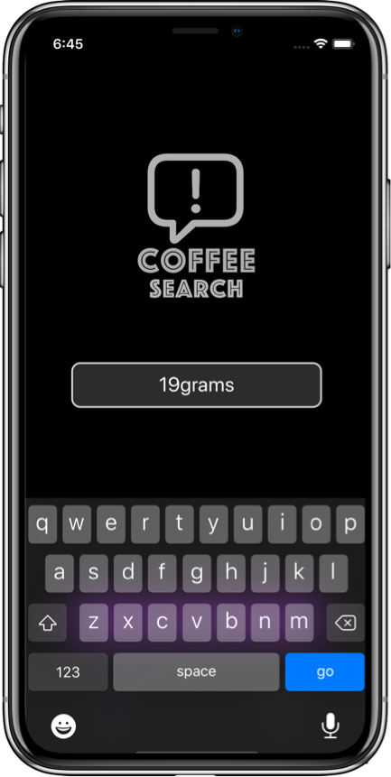

&nbsp;&nbsp;&nbsp;&nbsp;&nbsp;&nbsp;&nbsp;&nbsp;

# Hello!
This repo serves as a kind of ever-changing portfolio of projects I'm currently excited about; please feel free to look around. 

# iOS Apps
## GetFollowers
GetFollowers is a typical take home project iOS app created during the Sean Allen's tutorial. 

Using the GitHub API, it is built 100% with programmatic UI without storyboards. It displays the followers of an user, allowing to save favorites and visit the profile website of selected users.
  

  &nbsp;&nbsp;&nbsp;&nbsp;&nbsp;
&nbsp;&nbsp;&nbsp;&nbsp;&nbsp;
  &nbsp;&nbsp;&nbsp;&nbsp;&nbsp;

## PushingBoundaries
PushingBoundaries is an iOS app for the "Pushing Boundaries" 3D-print model exhibition in Germany, which I recently built during my internship. The specs were to build a basic museum app, and later to extend it with augmented reality. I decided to build something a bit more informative, creative, and colourful than just a basic AR app. The 3D models are organized in a table view for easy scrolling and searching.

I'm pleased with how the project came out. I like the app's responsiveness, UI design, and easily-extended architecture. PushingBoundaries was built with Xcode and written entirely in Swift 5; it utilizes Auto Layout for UI design and makes extensive use of UIView animations.  

  &nbsp;&nbsp;&nbsp;&nbsp;&nbsp;
&nbsp;&nbsp;&nbsp;&nbsp;&nbsp;
  &nbsp;&nbsp;&nbsp;&nbsp;&nbsp;

## CoffeeSearch

CoffeeSearch is a side project iOS app built in my free time. 
Using a webscraper written in Python and creating my own API, it displays the coffee sortiment for different coffee roasteries in Berlin, allowing to save favorites and visit the profile website of selected shops.  

Using the new diffing algorithm introduced by Apple in WWDC2019, it updates the collection view in real time upon entering or updating the search terms.  

The app is optimized for dark mode.

  

  &nbsp;&nbsp;&nbsp;&nbsp;&nbsp;
&nbsp;&nbsp;&nbsp;&nbsp;&nbsp;
  &nbsp;&nbsp;&nbsp;&nbsp;&nbsp;

# iOS Projects
## Playground: Emoji Memory Game

This is the final project for the certificate of the 100 Days of Swift by Paul Hudson. The challenge was to create a memory pairs game that has players find pairs of cards – it’s sometimes called Concentration, Pelmanism, or Pairs.  
I coded it in Xcode Playgrounds for mac using the Live View.  
it only has three states: the player has chosen zero cards, the player has chosen one card (flip it over), and the player has chosen two cards (flip the second one over). When they’ve chosen two cards I need to decide whether I have a match, then either remove the cards or flip them back down and go back to the first state.   
I enjoyed doing the project. It has not been trivial and I used emojis for the cards. To do so I had to convert a font or character to an image with a string extension. Many things in this project have required careful consideration. For fun, I have emoji confetti to be shown when the game ends and made extensive use of iOS animations.

 

  &nbsp;&nbsp;&nbsp;&nbsp;&nbsp;&nbsp;
  &nbsp;&nbsp;&nbsp;&nbsp;&nbsp;&nbsp;
&nbsp;&nbsp;&nbsp;&nbsp;&nbsp;&nbsp;

### Thanks for stopping by!

# Contact Info:

- Email: laurentbrusa@me.com
- LinkedIn: [LaurentBrusa](https://www.linkedin.com/in/laurentbrusa)
- Twitter: [@wrmultitudes](https://twitter.com/wrmultitudes)
- Website: [multitudes.github.io](https://multitudes.github.io)

