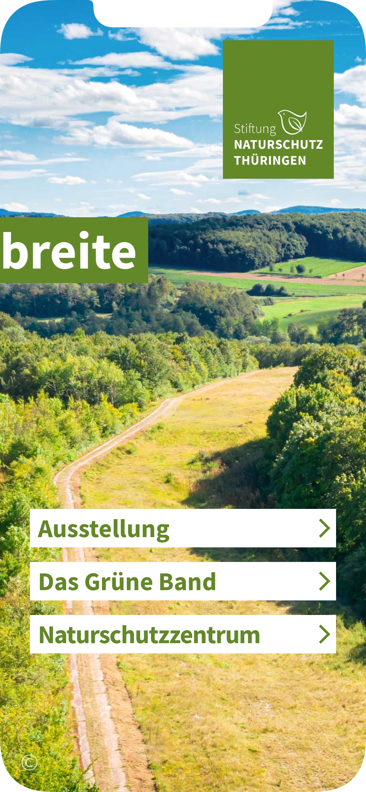
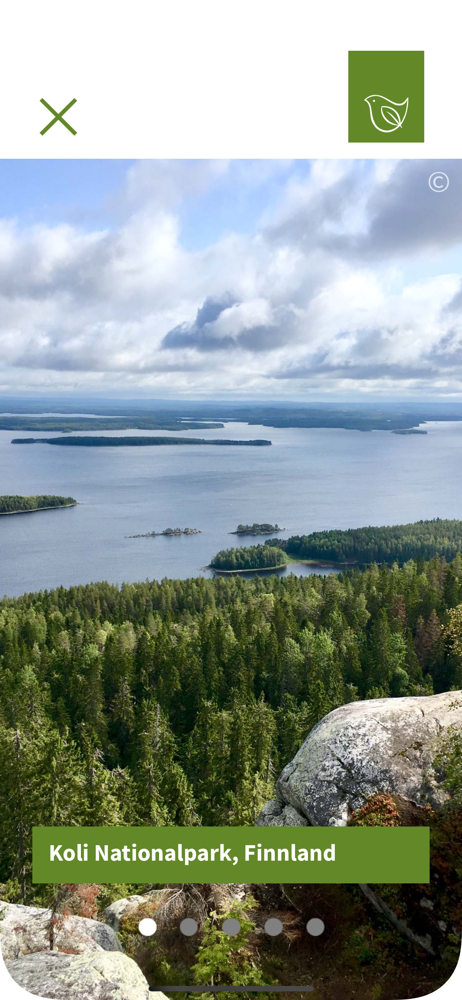
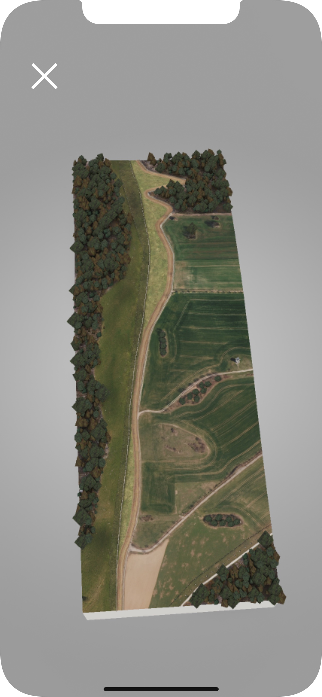
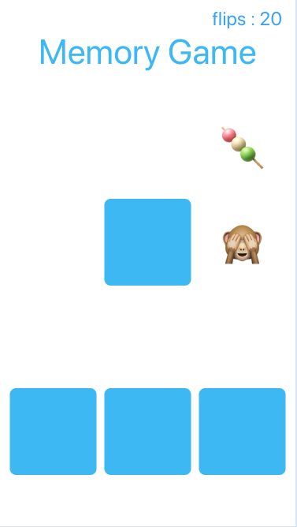

&nbsp;&nbsp;&nbsp;&nbsp;&nbsp;&nbsp;&nbsp;&nbsp;

# Hello!
This repo serves as a kind of ever-changing portfolio of projects I'm currently excited about; please feel free to look around. 

# iOS Apps

## Das Grüne Band / The green belt app

Sole developer of the iOS app for iPhone and iPad for the exhibition about the "German Green Belt" at the Thuringia Nature Conservation Foundation (Stiftung Naturschutz Thüringen) at the Egapark in Erfurt (Germany).  
Apple store [link](https://apps.apple.com/de/app/gr%C3%BCnebandbreite/id1557697472?l=en-GB).  
As per Wiki the [German Green Belt](https://en.wikipedia.org/wiki/German_Green_Belt) (Grünes Band) is the former East-West border line converted into nature reserves:
> The German Green Belt (Grünes Band Deutschland in German) is a project of Bund Naturschutz (BUND), one of Germany's largest environmental groups. The project began in 1989 facing a forbidding, 870-mile (1,400 km) network of fences and guard towers once ran the length of Germany, separating East and West. Now, one of the world's most unusual nature reserves is being created along the old "Death Strip," turning a monument to repression into a symbol of renewal. - Wikipedia. 

It has been a highly interesting and rewarding project. The app contains many image galleries, audio interviews, text, videos and a few augmented reality features. My colleagues at rooom made 3D models of the former border in 1985 and now, there is also a model of the border tower to be experienced in AR at the exhibition. 

The app is in German only for now but an English version is planned.  

 

  &nbsp;&nbsp;&nbsp;&nbsp;&nbsp;
  &nbsp;&nbsp;&nbsp;&nbsp;&nbsp;
 &nbsp;&nbsp;&nbsp;&nbsp;&nbsp;
   &nbsp;&nbsp;&nbsp;&nbsp;&nbsp;

  

## Airlock

Available on the App Store! 🥰 Link:  [Airlock Meditatio‪n](https://apps.apple.com/app/id1530067435)

Written entirely in SwiftUI!

The concept of the app is simple. 

The best ideas are coming when the mind is relaxed and alert at the same time.  
This app will allow you to practice, with the option to record your thoughts in a diary.

 

  &nbsp;&nbsp;&nbsp;&nbsp;&nbsp;
&nbsp;&nbsp;&nbsp;&nbsp;&nbsp;
  &nbsp;&nbsp;&nbsp;&nbsp;&nbsp;

  

Our brain works in different modes. There is the focused mode, which helps us to solve problems but is sometimes missing the big picture. There is the diffused mode, able to work in the background which is good for creativity, and then there is the meditative mode which is both alert and relaxed at the same time. 
This app allows you to practice short two minutes meditations. You can meditate any way you like, concentrating on your breath or sensations on your body. Try concentrating single-mindedly, remaining aware at all times. If your mind wanders, bring her back.   
Keep your equanimity. Accept the present moment and observe it. 
After the meditation, you can write a note to your future self, and save them to a file, visible in the Files app on your device.  
When you feel ready, a long press on the title, allows you to select a longer meditation time. I hope you enjoy using this app!  

## PushingBoundaries
PushingBoundaries is an iOS app for the "Pushing Boundaries" 3D-print model exhibition in Germany, which I recently built during my internship. The specs were to build a basic museum app, and later to extend it with augmented reality. I decided to build something a bit more informative, creative, and colourful than just a basic AR app. The 3D models are organized in a table view for easy scrolling and searching.

I'm pleased with how the project came out. I like the app's responsiveness, UI design, and easily-extended architecture. PushingBoundaries was built with Xcode and written entirely in Swift 5; it utilizes Auto Layout for UI design and makes extensive use of UIView animations. The code is on [GitHub](https://github.com/multitudes/3DPCiPAD)  
 

  &nbsp;&nbsp;&nbsp;&nbsp;&nbsp;
&nbsp;&nbsp;&nbsp;&nbsp;&nbsp;
  &nbsp;&nbsp;&nbsp;&nbsp;&nbsp;

  

## Recipes
A small recipe app which allows the user to manage cooking recipes.
The main screen is built using the new compositional layout part of the new iOS13 UICollectionView API. 
The app support dark mode and dynamic type. The code is on [GitHub](https://github.com/multitudes/charly-recipes)

 

  &nbsp;&nbsp;&nbsp;&nbsp;&nbsp;
&nbsp;&nbsp;&nbsp;&nbsp;&nbsp;
  &nbsp;&nbsp;&nbsp;&nbsp;&nbsp;

  

## NiceWeather

This is a proof of concept app. 
A weather app using the [openweathermap](https://openweathermap.org) RESTful API and displaying the weather for different cities in a customisable picker. The app is entirely written in SwiftUI without external libraries.  
I developed the app using the new Apple framework SwiftUI universal. It will work on iPhone iPad and even on macOS using Catalyst.  

After rewatching the WWDC 2020 video about localisation, I applied what I learned to the small side project I was working on, and I was surprised how easy it is to add support for like ten and more languages just out of the box with very little code and effort!  

Please see more documentation about this project and the code [here](https://github.com/multitudes/NiceWeather/blob/main/README.md)

 

  &nbsp;&nbsp;&nbsp;&nbsp;&nbsp;
&nbsp;&nbsp;&nbsp;&nbsp;&nbsp;
&nbsp;&nbsp;&nbsp;&nbsp;&nbsp;

  

## World Coffee Cupping App

This app is currently in beta on TestFlight.  
https://testflight.apple.com/join/wSaG1GYU

#### A beautiful coffee timer for the world coffee cupping held by James Hoffmann:

You can read more about the event here:
https://www.worldslargestcoffeetasting.com

This app is a timer app for professional coffee tasters and amateurs and it is written completely in SwiftUI 2.0 Universal and therefore requires iOS14.  

 

  &nbsp;&nbsp;&nbsp;&nbsp;&nbsp;
&nbsp;&nbsp;&nbsp;&nbsp;&nbsp;
  &nbsp;&nbsp;&nbsp;&nbsp;&nbsp;

  

James Hoffmann launched the first World Wide Coffee Cupping in 2019, and this app is a sort of homage to the idea of having a worldwide coffee tasting and possibly live with the event streamed on YouTube. If you miss the event then you can watch it later and follow on youtube, or you can use this app!  

Coffee professional from all over the world receives five samples of each a different coffee to cup. Tasting the coffee in this way is usually referred to as cupping in professional coffee circles.  

This app provides a timer allowing 15 seconds per cup to pour the water and then alerting after four minutes when it is time to break.  
To do this, you will use a spoon and gently stir and break the upper crust of coffee which has formed on the surface and at the same time smell the wet aromas.  

After this action, repeated five times for each cup, the timer goes on for another four minutes after then it is ok to start slurping the coffee taking a bit of it in your spoon if the temperature allows it.  

The coffee will eventually cool down, and the cupping finishes after 15 minutes.  

## CoffeeSearch

CoffeeSearch is a side project iOS app built in my free time. 
Using a webscraper written in Python and creating my own API, it displays the coffee sortiment for different coffee roasteries in Berlin, allowing to save favorites and visit the profile website of selected shops. The API is currently in development.  

Using the new diffing algorithm introduced by Apple in WWDC2019, it updates the collection view in real time upon entering or updating the search terms.  

The app is optimized for dark mode and developed entirely programmatically in code. 
The code is on [GitHub](https://github.com/multitudes/CoffeeSearch)  

 

  &nbsp;&nbsp;&nbsp;&nbsp;&nbsp;
&nbsp;&nbsp;&nbsp;&nbsp;&nbsp;
  &nbsp;&nbsp;&nbsp;&nbsp;&nbsp;

 

## GetFollowers
GetFollowers is a typical take home project iOS app created during the Sean Allen's intermediate iOS tutorial ['Take Home Project'](https://seanallen.teachable.com/courses/enrolled/681906). 

Using the GitHub API, it is built 100% with programmatic UI without storyboards. It displays the followers of an user, allowing to save favorites and visit the profile website of selected users.

 

  &nbsp;&nbsp;&nbsp;&nbsp;&nbsp;
&nbsp;&nbsp;&nbsp;&nbsp;&nbsp;
  &nbsp;&nbsp;&nbsp;&nbsp;&nbsp;

 

# iOS Projects
## My Personal Blog using Swift

I have been hosting [my personal blog and website](https://multitudes.github.io) on my [Github](https://github.com/multitudes) for quite some time, and when I heard that John Sundell announced his [`Publish`](https://github.com/johnsundell/publish) framework to make static webpage with Swift I was intrigued. 

I made and customised my website now entirely using Swift built as a package in Xcode on my mac locally and then synced to GitHub pages.  
(Since summer 2020 I moved my blog to hashnode for better visibility [https://laurentbrusa.hashnode.dev](https://laurentbrusa.hashnode.dev))

  

&nbsp;&nbsp;&nbsp;&nbsp;&nbsp;
 

  

## Playground: Emoji Memory Game

This is the final project for [the certificate](https://multitudes.github.io/images/hacking%20with%20swift%20certificate.jpg) of the [100 Days of Swift](https://www.hackingwithswift.com/100) by [Paul Hudson](https://twitter.com/twostraws). The challenge was to create a memory pairs game that has players find pairs of cards – it’s sometimes called Concentration, Pelmanism, or Pairs.  
I coded it in Xcode Playgrounds for mac using the Live View. 

I enjoyed doing the project. It has not been trivial and I used emojis for the cards. To do so I had to convert a font or character to an image with a string extension. Many things in this project have required careful consideration. For fun, I have emoji confetti to be shown when the game ends and made extensive use of iOS animations.

 
 

  &nbsp;&nbsp;&nbsp;&nbsp;&nbsp;&nbsp;
  &nbsp;&nbsp;&nbsp;&nbsp;&nbsp;&nbsp;
&nbsp;&nbsp;&nbsp;&nbsp;&nbsp;&nbsp;

  

### Thanks for stopping by!

# Contact Info:

- Links: https://linktr.ee/LaurentBrusa
- Email: laurentbrusa@me.com
- LinkedIn: [LaurentBrusa](https://www.linkedin.com/in/laurentbrusa)
- Twitter: [@wrmultitudes](https://twitter.com/wrmultitudes)
- Website: [multitudes.github.io](https://multitudes.github.io)

